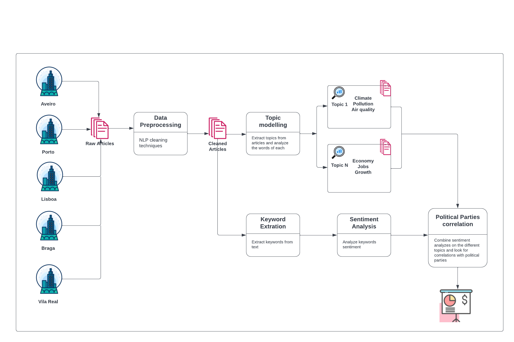

# SmartArchive

Analyze sentiment on different topics like life quality, economy, and pollution in Portugal district cities over the years.
Combine sentiment values with the political parties to extract some correlations.

**Possible approach:**




## Language models

### Spacy

```
python -m spacy download pt_core_news_lg
```
