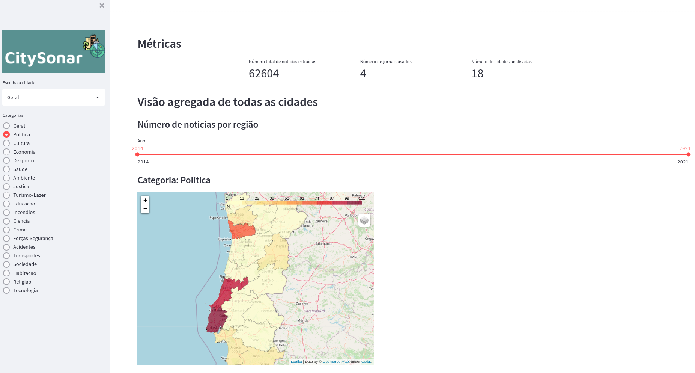

# CitySonar

  

**Goals**:

- Categorize newspapers news within different categories through a machine learning model trained from scratch.
- Analyze trends of the different categories over the years.
- Geolocation tool to see collected metrics on the different cities.

**Vision**: Using historical data from Arquivo.pt this tool could be helpful in providing insights about how subjects like Crime, Environment, and Health are evolving over the years in Portugal's district capitals. This could be used as a proxy for cities life quality.

  

## Application

The application has two different views. One that is related to the general overview and other at the city level.

### General overview

### City overview

## Language models

| Model | Usage | Obs |
| --- | --- | --- |
| Spacy | Pos-tagging | **pt_core_news_lg** model|
| Yake | Keyword extraction |  |

## Tasks

| Execute            |     |
|---                 | --- |
| make arquivo-scraper  | Pipeline for Arquivo data collection|
| make publico-scraper  | Pipeline for Publico data collection|
| make data-cleaning  | Pipeline for Arquivo data cleaning|
| make train-category-classifier | Train fasttext category classifier|
| make extract-arquivo-categories | Pipeline to extract categories from Arquivo data|
| make extract-keywords-publico | Pipeline to extract keywords from text using YAKE|
| make run-app | Runs Streamlit Geolocation app|

---

## TO DO

- Make streamlit app available at the public endpoint (Just runs locally at the moment).
- Display Arquivo articles on streamlit app with keywords. Currently, is just being shown the scrapped data directly from Público.

## Resources

- Video: https://drive.google.com/file/d/1D4pTse5fQ9K25i8y5y6MceYmL4zkCESu/view?usp=sharing
- Documentation: https://drive.google.com/file/d/1sBn6lIJ7dxjy4ysm_hc91IYgADjRWunq/view?usp=sharing
- Data: https://drive.google.com/drive/folders/188z6GLlUZrU0qHKwXViGmbEKH8NVtqaj?usp=sharing
